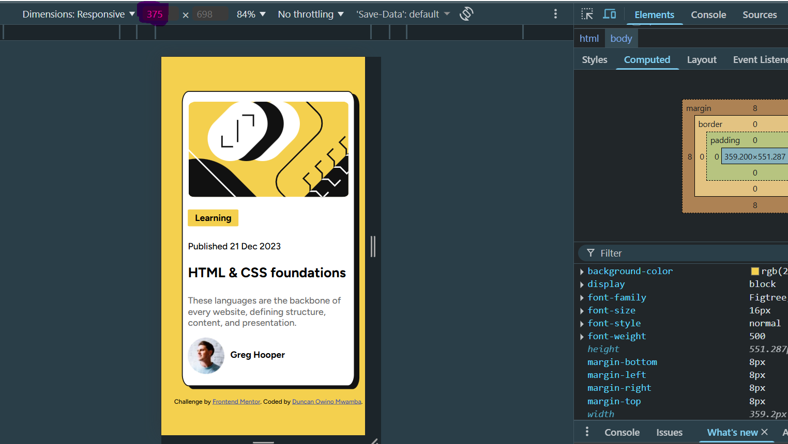
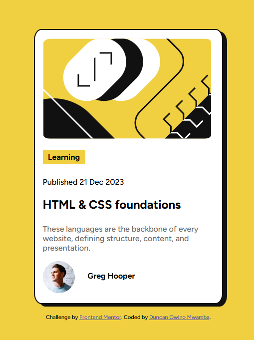

# Frontend Mentor - Blog preview card solution

This is a solution to the [Blog preview card challenge on Frontend Mentor](https://www.frontendmentor.io/challenges/blog-preview-card-ckPaj01IcS). Frontend Mentor challenges help you improve your coding skills by building realistic projects. 

## Table of contents

- [Overview](#overview)
  - [The challenge](#the-challenge)
  - [Screenshot](#screenshot)
  - [Links](#links)
- [My process](#my-process)
  - [Built with](#built-with)
  - [What I learned](#what-i-learned)
  - [Useful resources](#useful-resources)
- [Author](#author)
- [Acknowledgments](#acknowledgments)

## Overview

### The challenge

Users should be able to:

- See hover and focus states for all interactive elements on the page

### Screenshot

### Links

- Solution URL: [Blog Preview Card](https://github.com/mwambao/blog-preview-card)
- Live Site URL: [Blog Preview Card live URL](https://blog-preview-card-one-swart.vercel.app/)

## My process

### Built with

- Semantic HTML5 markup
- CSS custom properties
- CSS Grid
- Desktop-first workflow 

### What I learned

I enhanced my skills on using Grid just like i practised in [QR Code Component Challenge] (https://github.com/mwambao/qr-code-component)

### Useful resources

- [CSS Tutorial](https://www.w3schools.com/css/default.asp) - My place to go if i need to quickly check on something!
- [MDN for HTML and CSS](https://developer.mozilla.org/en-US/) - One of the primary resources.

## Author

- Website - [Duncan Owino Mwamba](https://mwambao.github.io/)
- Frontend Mentor - [@mwambao](https://www.frontendmentor.io/profile/mwambao)
- Twitter - [@mwambad](https://x.com/mwambad)

## Acknowledgments

